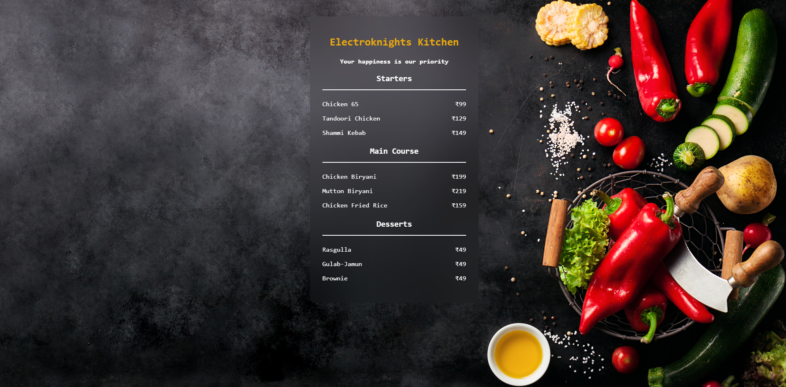

# 🍽️ Restaurant Menu Card

A simple and elegant restaurant menu webpage built using **HTML & CSS**.  
This project features a modern **glassmorphism menu card** with a full-screen food background image.

## 📸 Preview

## ⚡ Features
- Clean and minimal UI
- Glassmorphism effect using CSS
- Full-screen background image
- Beginner-friendly project

## 🛠️ Tech Stack
- HTML5
- CSS3

## 📌 Purpose
This is my mini project created to practice HTML structure, CSS styling, and layout design.

---

⭐ Feel free to star the repository if you like it!
